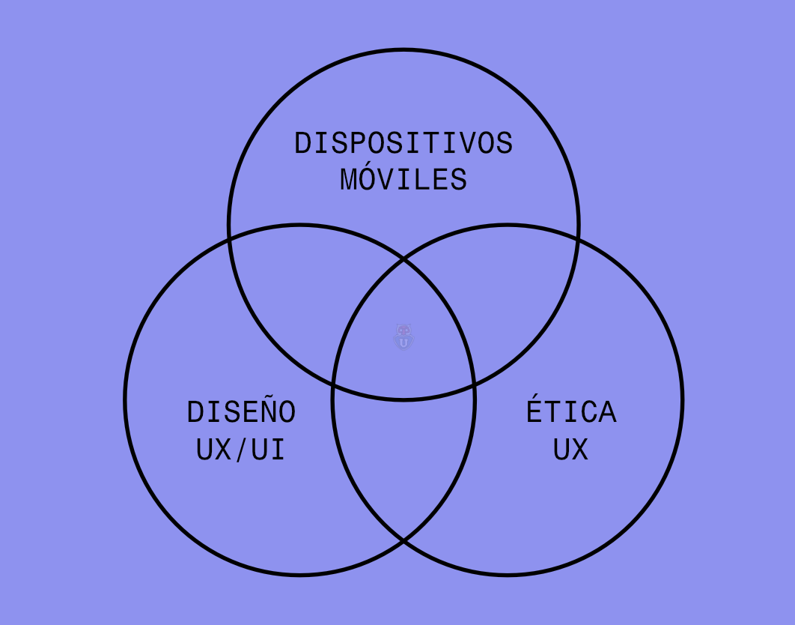

# encargo-02

## Instrucciones encargo 02: Estructura Investigativa, Fuentes y Referentes

### 1. Definición del Espacio del Tema (Diagrama de Venn)

El estudiante deberá visualizar la intersección de su proyecto mediante un Diagrama de Venn. Este debe articular tres ejes fundamentales:

- Disciplina del Diseño: El enfoque específico (ej. Diseño de Interacción, Diseño de Servicios).
- Tecnologías (UX & Hardware): Las herramientas técnicas y la interfaz de usuario.
- Temas y Contextos: El problema social, ambiental o de mercado y el entorno donde ocurre.

### 2. Estructura de Investigación y Estado del Arte

Para validar que el camino elegido no ha sido recorrido de la misma forma, se requiere:

- Análisis de Contenido: Definir los pilares que sostendrán la investigación.
- Búsqueda de Tesis Similares: Identificar al menos 2-3 proyectos de grado o investigaciones académicas previas que aborden problemas similares.
- Variedad de Fuentes: Recopilar bibliografía de primera categoría (papers científicos, informes gubernamentales, centros de pensamiento como el MIT Media Lab, IDEO, o bases de datos como Scopus/JSTOR) tanto a nivel global como local.

### 3. Acercamiento a Expertos (Metodología Cualitativa)

Diseñar la herramienta de captura de información directa:

- Diseño de Entrevista: Definir objetivos claros (¿qué necesito saber que no está en los libros?).
- Perfil y Contacto: Identificar al experto ideal, redactar el correo de contacto y agendar la sesión.

#### 4. Análisis de Referentes (Benchmark)

No basta con mirar qué existe; hay que analizarlo críticamente:

- Criterios de Selección: ¿Por qué estos referentes son relevantes?
- Tabla de Doble Entrada: Realizar un análisis comparativo cruzando los referentes con variables específicas (funcionalidad, estética, tecnología, impacto, usabilidad).

#### 5. Reflexión sobre oportunidades Figital

Definición de un problema de Diseño:

- Reflexión sobre oportunidades de Diseño Figital: Explorar las posibilidades que ofrece el entorno figital para abordar el espacio del problema, considerando cómo una atmósfera físico-digital puede contribuir a la experiencia del usuario.
- Definición del Tema (¿De qué trata y por qué es relevante? Evitar definiciones amplias o abstractas.)
- Pregunta de investigación (Debe guiar el desarrollo del proyecto y conectarse con el foco disciplinar y la dimensión tecnológica.)
- Palabras clave (Máx. 5, relacionadas con el área de estudio.)
- Problemática central ¿Qué desafío específico se aborda? Evitar generalizaciones.

#### Entregables sugeridos

1. Documento google slide: Que contenga todos los contenidos solicitados anteriormente. 7 minutos por persona.
2. Guión y análisis de Entrevista: Documento con el perfil del entrevistado y las preguntas diseñadas.

## Resolución encargo-02

### borrador

1. Definición del Espacio del Tema (Diagrama de Venn)

    template(se ve así porque mermaid no permite hacer diagrama de venn, así que lo adapté a las posibilidades):

    ```mermaid
    graph TD
        A["Disciplina del Diseño"] --> B["mi proyecto "]
        C["Tecnología"] --> B
        D["Temas y Contexto"] --> B
    ```

    relleno:

    ```mermaid
    graph TD
        A["Diseño UX"] --> B["mi proyecto "]
        C["UI"] --> B
        D["La manipulación dopamina"] --> B
    ```

2. Estructura de Investigación y Estado del Arte

    1. Pilares que sostienen la investigación:
        - Creadores de productos intenta manipular tu mente. Usan métodos psicológicos para evitar tu parte consciente y aludir directamente a tu lado instintivo.
        - La exposición a mediano y largo plazo a esto, genera personas impacientes, no reflexivas, inseguras(por compararse), etc.
        - Easy choices hard life, hard choices easy life

        lo q yo escribi fue cmo valórico, debiera ser más apegado a palabras clave, y conceptos q me ayuden a entender la línea argumental. Argumentos detrás de la filosofía de este proyecto. en vdd los pilares los queremos para q ayde a encontrar los referentes, (eso va dentro de los siguientes puntos del item 2) la idea de esta parte esq me ayude a enfocar mi búsqueda de otras tesis
    2. Búsqueda de Tesis Similares:
        - TODO
    3. Recopilar bibliografía de primera categoría:
        - TODO
3. Acercamiento a Expertos (Metodología Cualitativa)

## TODO DE NUEVOO

### 1 diagrama de venn

- Disciplina del Diseño.
- Tecnologías (UX & Hardware).
- Temas y Contextos.

¿Qué disciplina del diseño me gustaría explorar?

diseño UX. Me gustaría diseñar el flujo por el que pasa una persona en diferentes experiencias: comprando opa online, el flujo para entrar a un concierto, el flujo de trabajo de una cadena de trabajo, etc.

diseño UI/UX: me gustaría diseñar experiencias digitales que complementes experiencias físicas existentes. Gamificación de la experiencia, dfa mayor valor a producto final.

hardware/diseño UX: wearables, robots, etc

¿cuáles tecnologías me gustaría explorar?

microcontroladores, sensores, celulares, inteligencia artificial, bases de datos(?)

¿cuáles temas y contextos me gustaría explorar?

- los hábitos
- la digitalización gamificada de espacios culturales y de ocio
- la gamificación digital de espacios culturales y de ocio

###  Estructura de Investigación y Estado del Arte

Pilares de búsqueda:
Búsqueda de Tesis Similares: 
Variedad de Fuentes: 

### definición item 1

DISCIPLINA DEL DISEÑO: DISEÑO UX/UI

TECNOLOGÍAS: DISPOSITIVOS MÓVILES (táctiles(?))

TEMAS Y CONTEXTO: ÉTICA UX



### definición item 2

PILARES DE BÚSQUEDA:

- ética
- dark patterns
- neurociencia

BÚSQUEDA DE TESIS SIMILARES:

disponible en esta [carpeta](https://github.com/clifford1one-corteEstudioso/dis8vt1-2026-1/tree/main/bilbiografia/tesis-similares)

### pensamiento

es difícil dominar el limbo entre persuasión y usabilidad. Desde la usabilidad quieres que lo más intuitivo, sea lo que más probablemente el usuario quiera hacer. Desde la ética, esto magnificado, quizás puede llevar a comportamientos automatizados.

si tuviera que enfocarme en un tema ahora mismo, me gustaría pensar en la infancia como usuaria. En volá podría entrevistar al docente Víctor Rocha.

investigar como la fricción puede ser buena.

### item 3: acercamiento a expertes

#### diseño de entrevista

¿qué quiero saber?

- desde la neurociencia: quiero saber si "evolutivamente" ell humano se ha ido adaptando a desensibilizarse.

- desde la neurociencia, los hábitos.

- 

## youtube kids

3 planes:
- hasta 4 años
- entre 5 y 8 años
- entre 9 y 12 años

permite activar o desactivar la búsqueda