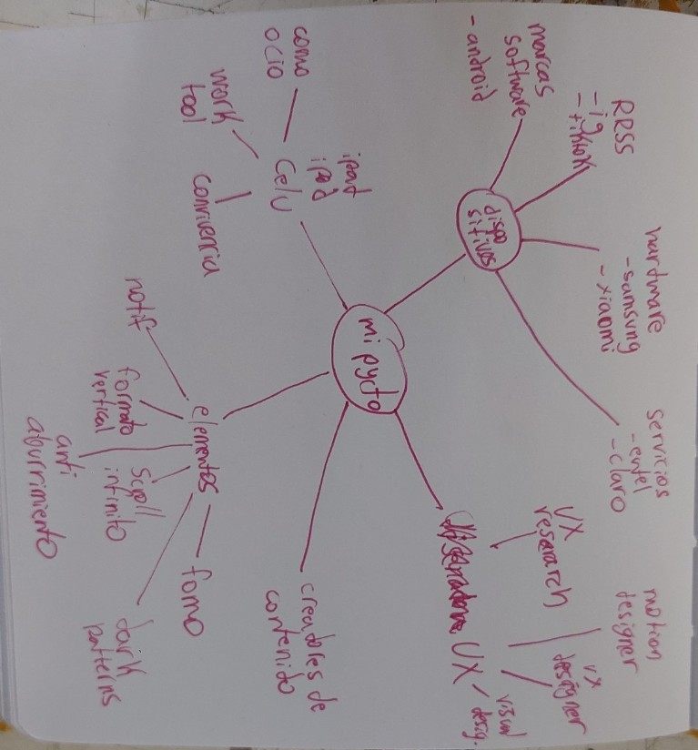

# sesion-04

2026-03-01

## avance pre clase

### diagrama de venn

previo: diseño UX/UI, ética UX, dipositivos móviles táctiles

nuevo: diseño UX/UI, ética, biológia

#### diseño UX UI

#### ética

#### neurociencia-sicología

#### diseño UX UI + ética

la base del diseño de experiencia está principalmente sostenida en la usabilidad. La usabilidad, para este caso, es un neologismo, que refiere a la funcionalidad y eficiencia, percibida y vivida por el usuarie en determinado producto. El considerado como "la biblia" de la usabilidad tiene como título. "No me hagas pensar".

La usabilidad fue un concepto la clave para la inserción de la tecnología en la sociedad(Davis, 1898). 

Según Davis, la adopción de la tecnología es determinada por su utilidad, y por us facilidad de uso. La mayoría de estas tecnologías, por su "naturaleza", nos es útil, lo que deja a la usabilidad como el factor más importnate para la adopción tecnológica.

La usabilidad llegó a tal punto que muchas personas podemos usar nuestro celular sin siquiera estar mirando, esuchando o pensando activamente qué hacer.

Es eso algo bueno? ¿"Disminuir" o "empeorar" la usabilidad podría ser un aporte a mi investigación?

- <https://www.jstor.org/stable/249008>

#### diseño UX UI + neurociencia/sicología

formación de hábitos. Aburrimiento

"No nos gusta estar sin hacer nada. Este Dios soy aburrido. Y nunca en la historia de la humanidad nos había sido tan fácil tener la mente ocupada en algo. Pero hacer nada también es necesario y hasta ahora nos estamos dando cuenta de la importancia que tiene."(macakiux, 2026)

temas relevantes: 

- Just think: the challenges of the disengaged mind:

el estudio, publicado en la revista science en 2014 explora fenómenos muy interesantes: en uno de sus experimentos, pusieron a personas en una habitación con paredes blancas, y sin ninguna distracción durante 15 minutos. Los usuarios del exp. tenían un electrodo en su pie que les daba una decsraga eléctrica dolorosa cuando apretaban un botón. De las 42 personas, 18 presionaron el botón durante el exp. Literal prefieren el dolor que el aburrimiento.

- dopamina: como las apps están diseñadas para pillarte volando bajo, para acudir a ese lado menos racional, más instintivo.

- <https://www.science.org/doi/10.1126/science.1250830>
- <https://es.wikipedia.org/wiki/Usabilidad>

#### ética + neurociencia/sicología

"red neuronal por defecto". Es un mecanismo del cerebro, que se activa cuando no hace nada, haces una tarea que no requiere toda o mucha de tu atención

en el fondo, la usabilidad quiere que usar una tecnología, sea lo más fácil y eficiente para ti. Entonces la usabilidad no es el problema, si no la app en sí. Si una app que te destruye el cerebro tiene una usabilidad tan buena, enfocada en atraparte.

la mente ha sido arduamente estudiada, con el objetivo de crear el producto perfecto que mantenga nuestra atención. Una hito muy habitual(intencional o no intencional, no sé) es la creación de hábitos respcto al celular, rrss y apps.

creación de hábitos: esto está basado en hábitos atómicos, james clear

fases de la creación de un hábito:

1. señal
2. anhelo
3. recompensa
4. respuesta

estas 4 etapas pueden ser útiles para crear o eliminar hábitos

    - cómo crear hábitos:
        1. hazlo obvio
        2. hazlo atractivo
        3. hazlo sencillo
        4. hazlo satisfactorio

    - cómo eliminar un hábito
        1. hacerlo invisible
        2. hacerlo poco atractivo
        3. hacerlo difícil
        4. hacerlo insatisfactorio

### HOW TO CREATE A GOOD HABIT

| Ley | Código | Acción |
| --- | --- | --- |
| Make It Obvious | 1.1 | Fill out the Habits Scorecard. Write down your current habits. |
| Make It Obvious | 1.2 | Use implementation intentions: “I will [BEHAVIOR] at [TIME] in [LOCATION].” |
| Make It Obvious | 1.3 | Use habit stacking: “After [CURRENT HABIT], I will [NEW HABIT].” |
| Make It Obvious | 1.4 | Design your environment. Make cues obvious and visible. |
| Make It Attractive | 2.1 | Use temptation bundling. Pair want + need. |
| Make It Attractive | 2.2 | Join a culture where the behavior is normal. |
| Make It Attractive | 2.3 | Create a motivation ritual before difficult habits. |
| Make It Easy | 3.1 | Reduce friction. Decrease steps. |
| Make It Easy | 3.2 | Prime the environment. |
| Make It Easy | 3.3 | Master the decisive moment. |
| Make It Easy | 3.4 | Use the Two-Minute Rule. |
| Make It Easy | 3.5 | Automate your habits. |
| Make It Satisfying | 4.1 | Use reinforcement. Immediate reward. |
| Make It Satisfying | 4.2 | Make “doing nothing” enjoyable. |
| Make It Satisfying | 4.3 | Use a habit tracker. |
| Make It Satisfying | 4.4 | Never miss twice. |

### HOW TO BREAK A BAD HABIT

| Ley (Inversión) | Código | Acción |
| --- | --- | --- |
| Make It Invisible | 1.5 | Reduce exposure. Remove cues. |
| Make It Unattractive | 2.4 | Reframe mindset. Highlight benefits of avoiding. |
| Make It Difficult | 3.6 | Increase friction. More steps. |
| Make It Difficult | 3.7 | Use a commitment device. Restrict choices. |
| Make It Unsatisfying | 4.5 | Get an accountability partner. |
| Make It Unsatisfying | 4.6 | Create a habit contract. |

¿es ético estudair el cerebro para entender como llegar a él de manera más atrapante/atractiva?

quizas, lo ético sería lo contrario, estudiar el cerebro para entender el punto justo en qu la usabilidad comienza a volverse un problema.

## clase

no podemos entender el ideo solo como el resultado de lo que hacemos. ¿cuál es nuestro rol en la sociedad en la que participamos?

pasos del semianrio:

1. encuadre
2. formulación
3. propuesta
4. definición

Cada vez que diseñamos algo, estanmos dejando una herencia al mundo. cuando no estemos, Vamos a dejar el mundo mejor de lo que estaba, pero de lo que estaba o igual?.

### actores de mi tema



### referentes de diseño y ética

    ```txt
    **Ética en Diseño — el diseñador como agente responsable**

    **Mike Monteiro — Ruined by Design (2019)**
    El más directo y combativo. Monteiro argumenta que los diseñadores no son ejecutores inocentes: tienen agencia, y por tanto responsabilidad sobre lo que diseñan y para quién. La pregunta central del libro es "¿a quién sirve realmente este diseño?" Muy útil para proyectos donde aparece la tensión entre cliente, usuario y sociedad.

    **Victor Papanek — Design for the Real World (1971)**
    El antecedente histórico ineludible. Papanek acusó a la profesión de diseñar para mercados en lugar de necesidades reales, y planteó la responsabilidad social del diseño décadas antes de que fuera moda. Shedroff lo cita directamente como precursor.

    **Don Norman — Design of Everyday Things (1988) + trabajos posteriores sobre "diseño para la humanidad"**
    Desde una postura más institucional, Norman ha evolucionado hacia preguntas sobre para qué y para quién diseñamos a escala sistémica. Su trabajo reciente sobre complexity y diseño en el siglo XXI es pertinente.
    ```

## boost seminario

una ia entrenada por un modelo especializado. Situada en el contexto de seminario phygital. Son 10 pasos, y los output.

### paso 1

- santiago clifford
- analogías, paso a paso

### paso 2

prompt: 

"Me apasiona el diseño de experiencias, con espcial foco en el flujo de los usuaries en una experiencia. Me importa la consciencia de clase, me gusta programar interfaces visuales, con código y diseñar en figma. Me gusta investigar, exponer y los discrusos. Me gusta mucho leer, sobretodo temas inevstigativos(no novelas), entre los libros que mas han marcado están: design for interaction - dan saffer, no me hagas énsar - steve krug, rompe la barrera del no - cris voss, hábitos atómicos - james clear, etc. Me importa mucho la lucha social, no intentar proteger a las grandes empresas, sino pensar en la gente, diseñar para los usuarios y no para la empresa. Me importa mucho la salud mental, y lo habitos que te yuadna a cuidarte, me preocupo mucho por lo que como, cuanto y cuando duermo, cuanto tiempo paso en pantalla, hacer ejercicio, dar ciertas cantidad de pasos diarios. Hace unos años me encuentro en un proceso activo de dejar la adicción al celular y a las redes sociales, me fijo en mi tiempo en pantalla, e intento que mi tiempo valga más la pena, es decir, no pasar mucho tiempo en el celular. me gustaría ser una contribución a este mundo desde el diseño UX UI. Nosé aun desde qué ámbito, quizas concientizar, quizas hacer una especie de manual, etc."

respuesta:
"¡Hola, Santiago! Es un placer acompañarte en este proceso. Tu pasión por el diseño de experiencias centrado en el flujo de usuarias y usuaries, tu profunda conciencia de clase y tu compromiso con la salud mental y la lucha social resuenan poderosamente con la dirección que estás explorando. Tu documento "encargo-03" ya establece una base sólida para investigar la intersección entre el diseño UX/UI, la ética y la biología, especialmente en lo que respecta a la vulneración del consciente y los límites éticos de la intervención. En este sentido, la labor de Marta Beltrán, quien advierte sobre la "esclavitud por diseño" y la pérdida de autonomía del usuario, se complementa con la mirada de Sánchez Chamorro et al., que delimitan la compleja frontera entre la persuasión y la manipulación, y todo esto encuentra un marco constructivo en la propuesta de Celia Hodent sobre un diseño que promueva el "florecimiento humano" a través de la comprensión de la neurociencia. Marta Beltrán, a través de su trabajo en FoSIP, ha sido una voz crítica en la identificación de patrones que explotan la vulnerabilidad del usuario en el entorno digital. Ella enfatiza cómo "los **dark patterns** explotan los **sesgos cognitivos** para generar dependencia, minando la **autonomía** del usuario y promoviendo una 'esclavitud por diseño'". (Fundación Observatorio de la Infancia en Internet, 2023). Esta afirmación es crucial para tu interés en la adicción al celular y la responsabilidad del diseño. Por otro lado, Sánchez Chamorro et al. profundizan en el dilema ético inherente a la profesión, señalando que "la distinción entre la **persuasión** transparente y la **manipulación** oculta radica en el respeto de la **agencia** y la autodeterminación del usuario". (Sánchez Chamorro et al., 2020, p. 74). Ambos autores convergen en la preocupación por la agencia del usuario, un concepto fundamental para tu lucha por un diseño que sirva a las personas y no a las empresas, y que sea consciente de la manipulación subyacente que puede afectar la salud mental y los hábitos. Existe una clara sintonía entre Beltrán y Sánchez Chamorro et al. en su preocupación por la **autonomía** del usuario y la distinción crítica entre diseño ético y manipulador. Ambos advierten sobre cómo el diseño puede ser utilizado para explotar vulnerabilidades cognitivas y socavar la capacidad de decisión de las personas. Sin embargo, sus enfoques difieren: Beltrán se centra más en la **identificación y taxonomía** de los "dark patterns" desde una perspectiva de derechos y protección (particularmente de la infancia, lo que resuena con los estándares IEEE y OMS que también citas), ofreciendo herramientas concretas para auditar interfaces. Sánchez Chamorro et al., en cambio, exploran las **tensiones éticas internas** que enfrentan los diseñadores, las percepciones de su propia capacidad de influir y las fricciones entre los objetivos de negocio y los principios de "usuario primero". Mientras Beltrán documenta la forma en que ocurre la manipulación, Sánchez Chamorro et al. se adentran en el *porqué* y las dinámicas que la propician desde la perspectiva del diseñador. Tu línea de investigación se conecta de manera fundamental con el **Diseño de Experiencias (UX)**, al buscar cómo el flujo del usuario puede ser éticamente guiado hacia hábitos saludables y un uso consciente de la tecnología, en lugar de ser explotado. Va más allá, conectando con el **Diseño Crítico**, al desafiar las prácticas actuales de la industria y las estructuras de poder que priorizan el lucro sobre el bienestar humano, tal como lo expresa tu conciencia de clase y tu interés en no "proteger a las grandes empresas". Finalmente, se entrelaza con el **Diseño Social**, buscando crear herramientas y conocimientos (quizás un manual o campañas de concientización, como mencionas) que contribuyan a un mundo donde la tecnología empodere y mejore la salud mental y el bienestar colectivo, en lugar de generar adicción y desigualdad.
Bibliografía
Fundación Observatorio de la Infancia en Internet. (2023). Guía para la detección de patrones oscuros: Intereses superiores de la niñez y adolescencia en el mundo digital. FoSIP Chile. Recuperado de https://www.fosip.cl/documentos (Se recomienda buscar el documento específico en el sitio para la referencia exacta).

Hodent, C. (2017). The Gamer's Brain: How Neuroscience and UX Can Impact Video Game Design. CRC Press.

Sánchez Chamorro, R., Del Campo, P., & López-García, C. (2020). Ethical Tensions in UX Design. En K. S. Lim & E. F. H. Tan (Eds.), UX Design: From Research to Delivery (pp. 71-89). Springer. DOI: https://link.springer.com/chapter/10.1007/978-981-15-5654-7_5"

### paso 3

prompt:

"no estoy tan seguro, pero 

respuesta:

respuesta"
"¡Hola, Santiago!

Es un placer seguir profundizando contigo en esta área tan crucial y apasionante. Tu compromiso con un diseño ético y centrado en el bienestar humano es verdaderamente inspirador, y tus ideas sobre "light patterns", interfaces con una "perspectiva de dopamina" y la comunicación del valor de un diseño consciente son excelentes puntos de partida para expandir tu reflexión disciplinar. Has mapeado muy bien el terreno de los desafíos (dark patterns, manipulación) y la necesidad de estándares, y ahora es el momento de explorar cómo el diseño puede ser una fuerza proactiva para el bien.

Para robustecer tu mirada sobre cómo el diseño puede expandir o transformar tu tema, he identificado a tres autores cuyas obras se conectan directamente con tus inquietudes, ofreciendo marcos y metodologías para construir soluciones éticas y empoderadoras. Estos autores te ayudarán a pensar no solo en cómo evitar el daño, sino en cómo diseñar activamente para el florecimiento humano y la autonomía del usuario.

1. BJ Fogg (Teoría de los Hábitos Diminutos - Tiny Habits)
Enfoque o Postura: BJ Fogg, director del Laboratorio de Diseño de Comportamientos en la Universidad de Stanford, es un pionero en el campo del diseño de comportamientos. Su enfoque se centra en comprender cómo se forman los hábitos y cómo el diseño puede facilitar cambios de comportamiento positivos a través de "hábitos diminutos". Su modelo, el Fogg Behavior Model (B=MAP), establece que para que un comportamiento ocurra, se necesitan tres elementos simultáneamente: Motivación, Habilidad (la facilidad de la tarea) y un Prompt (un recordatorio). Fogg aboga por hacer que los comportamientos deseados sean tan fáciles que se requiera poca motivación, generando así cambios sostenibles.
Coincidencias y Diferencias:
Coincidencias: Fogg complementa la perspectiva de Celia Hodent sobre la "usabilidad" (facilidad) como pilar del "engage-ability" (motivación), ofreciendo un marco práctico para diseñar esa facilidad con un propósito ético. Su trabajo es una respuesta directa al problema de la adicción que te preocupa, al mostrar cómo el diseño puede *construir* hábitos saludables en lugar de destructivos, lo que se alinea con la distinción de Catalina Montero entre uso productivo y distractivo. En lugar de solo alertar sobre "dark patterns" como Marta Beltrán, Fogg provee las herramientas para construir "light patterns" que guíen al usuario hacia resultados positivos.
Diferencias: A diferencia de los referentes que critican la manipulación (Beltrán, Sánchez Chamorro et al.), Fogg se enfoca en cómo la influencia del diseño puede ser utilizada de manera ética para el empoderamiento personal. Su modelo no se centra en la "fricción ética" para detener una acción, sino en la "fluidez ética" para iniciar una acción beneficiosa. Si bien comparte la base neurocognitiva (cómo funciona el cerebro en la toma de decisiones) con Hodent, Fogg la aterriza en una metodología concreta para el diseño de productos.
Nuevas Perspectivas: Fogg te ofrece un manual práctico sobre cómo diseñar esos "light patterns" que buscas. Puedes utilizar su marco para desglosar tus objetivos de "diseño con perspectiva de dopamina" en pasos concretos: ¿cómo podemos diseñar interfaces que hagan que el uso productivo sea el camino de menor resistencia? ¿Cómo se puede generar una recompensa intrínseca (no adictiva) para acciones que benefician la salud mental y los hábitos? Su trabajo te permite pasar de la crítica a la creación de soluciones viables que fomenten la autonomía y el bienestar del usuario, diseñando para el éxito del usuario en la consecución de sus propias metas.
2. Indi Young (Modelos Mentales y Empatía Práctica)
Enfoque o Postura: Indi Young es una experta en investigación de usuarios y fundadora de Adaptive Path. Su trabajo principal se centra en la "empatía práctica" y la creación de "modelos mentales" como herramientas para comprender profundamente a las personas que usan nuestros productos. No se trata solo de observar comportamientos, sino de entender las motivaciones, pensamientos, creencias y principios subyacentes que guían las acciones de los usuarios. Al mapear estos modelos mentales, los diseñadores pueden crear experiencias que resuenen genuinamente con lo que los usuarios intentan lograr, sus aspiraciones y sus luchas internas.
Coincidencias y Diferencias:
Coincidencias: El enfoque de Young en la comprensión profunda del usuario es fundamental para el "usuario primero" que defienden Sánchez Chamorro et al., proporcionando la metodología para ir más allá de la superficie. Su insistencia en el conocimiento de las motivaciones internas se alinea con tu interés en la "perspectiva de dopamina" y en cómo el diseño puede influir en hábitos y decisiones, asegurando que esta influencia sea para el bien. Resuena con tu conciencia de clase y tu deseo de diseñar para la gente, no para la empresa, al poner las necesidades humanas reales en el centro.
Diferencias: Mientras que Marta Beltrán identifica patrones de manipulación a nivel de interfaz, Indi Young proporciona las herramientas para entender *por qué* esos patrones son efectivos, al explotar las debilidades en los modelos mentales de los usuarios. A diferencia de Fogg, que se centra en cómo diseñar para el comportamiento, Young se enfoca en cómo *investigar* para comprender la psique del usuario *antes* de diseñar, garantizando que el diseño sea fundamentalmente ético y alineado con las metas del usuario.
Nuevas Perspectivas: Indi Young te ofrece una base metodológica robusta para asegurar que tus "light patterns" y tus interfaces con "perspectiva de dopamina" no sean meras suposiciones, sino que estén profundamente arraigadas en una comprensión empática de lo que los usuarios realmente necesitan para construir hábitos saludables y vivir una vida consciente. Te ayudará a diseñar no solo lo que es "fácil de usar" (como diría Steve Krug, a quien admiras), sino lo que es *verdaderamente útil* y *emocionalmente resonante* con los objetivos de vida de los usuarios, defendiendo así su autonomía de una manera proactiva y bien informada.
3. Tristan Harris (Center for Humane Technology - CHT)
Enfoque o Postura: Tristan Harris, cofundador del Center for Humane Technology (CHT), es una de las voces más prominentes en la crítica al modelo de la "economía de la atención" y en la abogacía por un diseño tecnológico más ético y humano. Su trabajo se centra en exponer cómo los modelos de negocio actuales de las plataformas digitales están diseñados para maximizar el "tiempo en pantalla" a expensas del bienestar, la democracia y la salud mental. Propone principios de "diseño humano" (Humane Design) y aboga por cambios sistémicos, tanto en el diseño de productos como en la regulación, para realinear la tecnología con los intereses de la humanidad, promoviendo el "tiempo bien invertido" (Time Well Spent).
Coincidencias y Diferencias:
Coincidencias: Harris y el CHT son un referente clave para tu lucha contra la adicción al celular y las redes sociales, y tu deseo de ser una contribución a este mundo desde el diseño UX/UI. Su trabajo encapsula la esencia de la "esclavitud por diseño" de Marta Beltrán y las "tensiones éticas" de Sánchez Chamorro et al., pero las eleva a un nivel de movimiento social y propuesta de soluciones sistémicas. Se alinea directamente con tu interés en la salud mental, el tiempo en pantalla y tu conciencia de clase, al exponer cómo las grandes empresas explotan vulnerabilidades a gran escala.
Diferencias: A diferencia de los autores que se centran en el análisis académico (como la mayoría de tus referentes actuales), Harris es un activista y un "practitioner" que busca implementar cambios concretos a través de la influencia en la industria y la opinión pública. Mientras Fogg ofrece herramientas para el diseñador individual, Harris y CHT ofrecen un marco ideológico y una plataforma para el cambio a nivel de industria y sociedad. Si bien tus referentes (IEEE, OMS) establecen directrices regulatorias, CHT es una fuerza motriz detrás de la concepción y promoción de tales regulaciones desde la perspectiva de la ética del diseño.
Nuevas Perspectivas: Tristan Harris y el CHT te proporcionan el marco narrativo y la visión macro para tu idea de "marketing" el valor del diseño ético. Su enfoque en el "tiempo bien invertido" es un excelente contrapunto a la "perspectiva de dopamina" si esta última se usa para manipular. Te invita a pensar no solo en manuales o interfaces, sino en cómo tu trabajo puede ser parte de un movimiento más amplio para concientizar y empoderar a la sociedad, influenciando no solo a los diseñadores sino también a los consumidores y reguladores. Te muestra cómo el diseño puede ser una herramienta poderosa para la lucha social que tanto te importa, transformando la conversación pública sobre la tecnología.
Espero que estas perspectivas te inspiren a seguir explorando cómo el diseño puede ser una fuerza para el bien, construyendo activamente un mundo digital más humano y consciente. ¡Adelante con tu investigación, Santiago!"

### paso 4

me pidieron que dijera ideas de como contribuir a la sociedad desde mi investigacion

respuesta:
"¡Hola, Santiago!

Es estimulante ver cómo tus reflexiones avanzan de la crítica hacia propuestas concretas y transformadoras. Tus nuevas ideas, como la creación de un "manual para el diseño con perspectiva de dopamina" y la audaz exploración de "darle la vuelta" a los elementos que causan uso compulsivo –incluso proponiendo alternativas análogas a las interacciones táctiles–, son el tipo de pensamiento innovador que se necesita para desafiar el statu quo y construir un futuro digital más humano. Estas propuestas no solo identifican el problema, sino que empiezan a esbozar soluciones tangibles y éticas, alineadas con tu visión de contribuir desde el diseño UX/UI.

Análisis Enriquecido: Fundamentando la Transformación
Para sustentar y enriquecer estas valiosas ideas, podemos recurrir a enfoques que articulan cómo el diseño puede ser una fuerza proactiva para el bienestar, yendo más allá de la mera reacción ante los dark patterns. Aquí te presento algunos que dialogan directamente con tus propuestas:

BJ Fogg y el Diseño de Comportamientos para el Bienestar (Tiny Habits)
Tu idea de un "manual para el diseño con perspectiva de dopamina" encuentra un fundamento teórico y práctico sólido en el trabajo de BJ Fogg. Fogg, a través de su modelo de Comportamiento (B=MAP: Behavior = Motivation, Ability, Prompt) y su metodología de Tiny Habits (Hábitos Diminutos), nos enseña cómo diseñar para la formación de hábitos deseables de manera ética. A diferencia de la explotación de la dopamina para generar dependencia, Fogg propone entender estos mecanismos neurocognitivos para facilitar acciones positivas y saludables. Su enfoque no busca manipular la motivación intrínseca, sino reducir la fricción (aumentar la "Ability") de los comportamientos beneficiosos y proporcionar los "Prompts" adecuados en el momento oportuno. Un "manual con perspectiva de dopamina" basado en Fogg sería una guía para crear "light patterns" que, en lugar de atrapar al usuario, lo empoderen para alcanzar sus propias metas de bienestar y salud mental, conectando directamente con tu preocupación por hábitos saludables y el "uso productivo" de la tecnología que mencionas con Catalina Montero.

Calm Technology y Slow Technology: Hacia Interfaces Respetuosas
Tu propuesta de "identificar el elemento que causa el uso compulsivo e intentar darle la vuelta", especialmente el ejemplo de explorar maneras análogas de manejar el celular, resuena poderosamente con los principios de la Calm Technology (Tecnología Serena) y la Slow Technology (Tecnología Lenta). La Calm Technology, conceptualizada por Mark Weiser y John Seely Brown, aboga por un diseño donde la tecnología se integra discretamente en nuestras vidas, operando en la periferia de nuestra atención y solo demandando foco cuando es realmente necesario. No se trata de eliminar la tecnología, sino de hacerla menos intrusiva y demandante, respetando nuestros ciclos de atención y la primacía de la vida "real". La Slow Technology profundiza esta idea, promoviendo sistemas tecnológicos que fomentan la reflexión, la paciencia y la interacción intencional, en contraste con la inmediatez y el consumo constante. Este enfoque proporciona un marco crítico para reevaluar la primacía de las interfaces táctiles y digitales que priorizan la velocidad y la gratificación instantánea, abriendo la puerta a paradigmas de interacción que valoren la "fricción ética" (Sánchez Chamorro et al.) no como un obstáculo, sino como un medio para fomentar la autonomía y la deliberación. Pensar en lo análogo es un excelente camino para concretar la idea de interacciones más lentas, conscientes y respetuosas con el ritmo humano.

Un Enfoque Transformador para el Diseño de Experiencias
Santiago, tus ideas marcan un camino decisivo: pasar de la disección crítica de los problemas éticos del diseño a la construcción proactiva de soluciones. Al integrar las metodologías de BJ Fogg para el diseño de comportamientos positivos y abrazar la filosofía de la Calm Technology para repensar fundamentalmente nuestras interacciones con la tecnología, tu proyecto se posiciona como una respuesta situada y crítica al actual paradigma de la "economía de la atención". Estas perspectivas no solo ofrecen herramientas para un "diseño con perspectiva de dopamina" ético, sino que también sustentan la importancia de adoptar un nuevo enfoque desde el diseño, uno que priorice la autonomía del usuario, la salud mental y el bienestar colectivo sobre el beneficio corporativo. El diseño, en este contexto, se reafirma como un articulador de soluciones transformadoras, capaz de redefinir no solo cómo interactuamos con la tecnología, sino cómo la tecnología puede servir verdaderamente al florecimiento humano, tal como aspiras a contribuir en este mundo."

### paso 5

"Aquí tienes una nueva formulación, adoptando un tono más formal y académico, sin perder la esencia y la pasión de la reflexión original:
Reformulación del Concepto: "Light Patterns para el Florecimiento Digital"
El paradigma de "Light Patterns para el Florecimiento Digital" emerge como una propuesta metodológica y éticamente fundamentada para contrarrestar los desafíos de la adicción digital y fomentar la autonomía del usuario. Inspirado en el modelo de comportamiento de BJ Fogg, este enfoque se distingue por trascender la manipulación inherente a los Dark Patterns –que explotan vulnerabilidades cognitivas– para, en su lugar, diseñar interacciones que hagan de la adopción de hábitos saludables el camino de menor resistencia, cultivando así un bienestar intrínseco.

La aplicabilidad de esta perspectiva es sumamente diversa, abarcando desde la creación de micro-interacciones lúdicas que faciliten a los "niños iPad" una transición fluida del entorno digital a actividades offline significativas, hasta la orquestación de flujos de trabajo profesionales donde la consecución de tareas productivas genere una "dopamina ética", redirigiendo activamente la atención de distracciones adictivas como los "reels". Este marco no solo dota al diseñador de herramientas (como código y Figma) para guiar conscientemente el comportamiento del usuario hacia su florecimiento, sino que también ofrece una vía tangible para abordar y transformar la lucha personal contra la dependencia tecnológica.

Para Santiago, la concepción de Light Patterns no es solo una contribución al campo UX/UI; es la materialización de su interés profundo en la salud mental y los hábitos, y su compromiso con un uso más responsable de la tecnología. Representa la oportunidad de convertir una experiencia personal en una herramienta para "diseñar para la gente y no para la empresa", alineando la teoría del comportamiento con una práctica de diseño intrínsecamente social, empoderadora y orientada al bienestar colectivo."

### paso 6

prompt:

"Resumen del Proyecto
A continuación se presenta una síntesis consolidada de los pasos iniciales de su proyecto. Para una revisión completa, por favor, rellene las secciones con su trabajo detallado. Este marco se actualizará automáticamente una vez que proporcione la información. Tema [Por favor, inserte aquí el tema principal o el enfoque central de su proyecto, tal como lo definió en el Paso 2.] Este elemento es la piedra angular que define el propósito y la dirección de todo el esfuerzo subsiguiente. Exploración Temática [Por favor, inserte aquí los hallazgos clave de su investigación y exploración del tema, incluyendo cómo la inteligencia artificial o herramientas similares pudieron haber asistido en este proceso (Paso 2, IA).] Esta sección detalla la comprensión profunda y la contextualización del tema, sirviendo como base empírica y conceptual para las etapas de diseño. Reflexión sobre Diseño [Por favor, inserte aquí su análisis y pensamiento crítico sobre los enfoques de diseño, los principios aplicables o las decisiones clave que surgen de la exploración temática (Paso 3).] Aquí se articulan las consideraciones teóricas y prácticas que guiarán la creación, conectando la investigación con las intenciones de diseño. Contribución Personal [Por favor, inserte aquí los aspectos únicos o las ideas originales que usted aporta al proyecto, reflejando su perspectiva e involucramiento (Paso 4).] Esta parte destaca su voz individual y cómo sus propias experiencias o puntos de vista enriquecen y diferencian el trabajo. Oportunidad de Diseño [Por favor, inserte aquí la oportunidad específica, el problema a resolver o el área de mejora que ha identificado y que su diseño busca abordar (Paso 5).] Este es el resultado tangible de los pasos anteriores, una declaración clara de cómo su proyecto pretende generar valor o impacto."

respuesta:
"**User Persona Potencial**
¡Excelente desafío, Santiago! Es fascinante cómo tu proyecto entrelaza la usabilidad con la profunda ética de la neurociencia y la vulnerabilidad humana. Crear un *User Persona* no es solo dar un nombre, es insuflar vida a los datos, permitiendo que las implicaciones abstractas se conviertan en experiencias tangibles. Vamos a darle cuerpo a esos "usuarios" para que no solo los puedas entrevistar, sino que puedas empatizar profundamente con su dilema. --- ### **User Persona 1: Martín, el Navegante Consciente**
Conozcamos a Martín, el Navegante Consciente. A sus 26 años, Martín es un diseñador gráfico freelance con sede en Valparaíso. Su día a día es un malabarismo constante entre proyectos creativos, reuniones con clientes y el anhelo de tiempo libre para sus hobbies: el senderismo y la lectura. Su celular es, sin duda, su principal herramienta de trabajo y conexión social. Lo usa para coordinar proyectos, consultar referencias de diseño y, por supuesto, mantenerse al día con sus amigos en Instagram.

Martín vive el dilema que tu proyecto busca abordar con una aguda conciencia. Él sabe que necesita su celular para ser funcional en la sociedad actual y para mantener sus relaciones, como "hablar con mis amigues por Insta". Sin embargo, cada vez que abre la aplicación, se siente arrastrado por una fuerza casi invisible. Es la frustración de saber que, con un simple desliz, el "acceso fácil a los reels" se convierte en una hora perdida, una hora que debería haber dedicado a un cliente o a planificar su próxima ruta de senderismo. "Tener fácil acceso a los reels/shorts/tiktok hace que eventualmente los termine usando", se repite con un suspiro de resignación.

Lo que siente Martín es una mezcla de culpa, frustración y una creciente sensación de pérdida de autonomía. Ha leído sobre los "dark patterns" y cómo explotan los sesgos cognitivos, y se siente personalmente atacado por lo que percibe como una "esclavitud por diseño" (Marta Beltrán). Él no quiere "abstenerse de usar o tener un celular", pero anhela "escapar de las consecuencias del uso prolongado y sostenido". Desea fervientemente recuperar el control, esa "agencia del usuario" que menciona Sánchez Chamorro, y que su relación con la tecnología sea una de "persuasión transparente" y no de "manipulación oculta". Sueña con el "florecimiento humano" (Celia Hodent) que una tecnología ética debería permitir, en lugar de minar su productividad y bienestar.

Específicamente, Martín necesita una fricción ética inteligente. Una solución que, sin bloquearle completamente el acceso a las funciones esenciales de su teléfono o a su conexión social, le ponga barreras significativas, pero respetuosas, justo en el umbral de la compulsión. Algo que "intervenga en los mecanismos neurocognitivos que sustentan hábitos y decisiones" de una manera que le devuelva el poder a su propia voluntad, en lugar de capitalizar su vulnerabilidad biológica. No quiere una niñera digital; quiere una herramienta que le ayude a ejercer su autodominio.

Martín se beneficiaría directamente de tu proyecto porque busca una herramienta que le permita utilizar su celular de forma productiva y conectada, sin caer en el uso distractivo que le roba tiempo y energía. Una solución que incorpore principios de "diseño enfocado en la vulnerabilidad biológica" de manera ética le daría la oportunidad de reformar sus hábitos, mejorar su productividad y, lo más importante, recuperar el valioso tiempo para lo que realmente lo hace feliz.

--- ### **User Persona 2 (Versión Alternativa): Sofía, la Optimista Distraída**
Permítanme presentarles a Sofía, la Optimista Distraída. Con 19 años, Sofía es estudiante de primer año de Trabajo Social en Santiago. Su vida es un torbellino de clases, grupos de estudio, voluntariado y, por supuesto, una intensa vida social. Para ella, el celular no es solo una herramienta; es una extensión de su mundo, una fuente inagotable de conexión, información y entretenimiento. Siempre está en WhatsApp con sus compañeros, revisando Instagram para ver los planes de fin de semana o scrolleando TikTok para las últimas tendencias.

Sofía experimenta el problema que tu proyecto aborda, pero su percepción es ligeramente diferente a la de Martín. Si bien comparte el comportamiento de "quiero poder hablar con mis amigues por insta, pero tener acceso a los reels me permite meterme y perder mucho tiempo", su frustración no radica tanto en la sensación de "manipulación" o "pérdida de autonomía". Para Sofía, la facilidad de acceso a los "reels/shorts/tiktok" es simplemente una fuente de *escape y gratificación instantánea* que, sin darse cuenta, se extiende más de lo deseable. Su dolor no es tanto la "esclavitud por diseño", sino la fatiga, la falta de sueño y la sensación de que las horas se le escurren sin control, impactando su rendimiento académico y su bienestar físico (como las advertencias de la OMS sobre tiempo de pantalla y desarrollo cognitivo).

Lo que siente Sofía es una mezcla de diversión, FOMO (miedo a perderse algo), una leve irritación ante la autoprocrastinación y una fatiga difusa. Ella disfruta del "flujo" inmersivo que le proporcionan estas plataformas (Catalina Montero), y a menudo ni siquiera se da cuenta de cuánto tiempo ha pasado. Su motivación principal para usar el teléfono es la "utilidad percibida" (Cáceres-Ramírez) para la conexión social y el entretenimiento, pero la "facilidad de uso" de las funciones adictivas la arrastra. No se siente activamente manipulada, sino más bien *superada* por la oferta constante de contenido. Sus "necesidades" giran en torno a cómo puede "escapar de las consecuencias" (cansancio, tareas sin hacer) *sin sacrificar* el placer y la conexión que su teléfono le brinda.

Específicamente, Sofía necesita una guía sutil y no intrusiva. Una solución que le ayude a establecer límites saludables y a discernir entre el "uso productivo" y el "uso distractivo" de su teléfono, pero sin que se sienta como una restricción punitiva. Quizás algo que la ayude a ser consciente del tiempo que pasa en ciertas aplicaciones sin que eso le impida participar activamente en la vida digital que tanto valora. No está buscando una confrontación con la ética del diseño, sino una forma de gestionar mejor su propia energía y tiempo.

Sofía se beneficiaría de tu proyecto porque una solución que aplique los principios de "usabilidad como aporte a la adopción tecnológica" y un "diseño enfocado en la vulnerabilidad biológica" de forma proactiva y amigable podría ayudarla a encontrar un equilibrio. Al respetar su necesidad de conexión y entretenimiento, pero introducir "fricción ética" de una manera que la empodere sutilmente para tomar decisiones más conscientes, tu proyecto le permitiría disfrutar de su vida digital sin las molestas consecuencias de la sobreexposición, contribuyendo así a su bienestar general y al tan buscado "florecimiento humano"

**entrevista cuali**
"¡Excelente, Santiago! Como Investigador Senior de UX, es un honor robustecer esta guía. Has sentado una base sólida que ya empatiza con la delicadeza ética de tu proyecto. Mi enfoque será pulir la claridad, afinar el foco en los matices de Martín y Sofía, y asegurar que cada pregunta nos acerque más a la raíz de sus experiencias, sus dilemas éticos y sus aspiraciones. Aquí tienes la guía de entrevista robustecida: ---
Guía de Entrevista: Navegando la Interacción Consciente con el Smartphone
Contexto de la Entrevista: Hola [Nombre del Participante], gracias por estar aquí. Estamos realizando una investigación profunda sobre cómo las personas interactúan con sus smartphones en su día a día. Queremos entender no solo lo que haces, sino también lo que sientes, piensas y esperas de tu dispositivo, especialmente cuando se trata de funciones que pueden ser muy atractivas o demandantes de tiempo, como las redes sociales o los videos cortos. Nuestro objetivo principal es comprender tus experiencias para poder diseñar soluciones más éticas y centradas en el bienestar del usuario.

Confidencialidad: Antes de comenzar, quiero asegurarte que esta conversación es completamente confidencial. Todo lo que compartas hoy es valiosísimo para nuestra investigación y será tratado de forma anónima, utilizado únicamente para entender mejor el problema que estamos abordando. Por favor, siéntete libre de expresarte con total honestidad.

Objetivo Principal de la Entrevista:
El objetivo principal de esta entrevista es explorar en profundidad las experiencias, percepciones, hábitos y desafíos de los participantes respecto al uso de sus smartphones, con un enfoque particular en la interacción con funciones altamente atractivas (como feeds de redes sociales, videos cortos). Buscamos comprender las tensiones entre la necesidad de conexión/utilidad y la sensación de pérdida de control o tiempo, para informar el diseño de soluciones éticas que fomenten la autonomía y el bienestar del usuario, aplicando los principios de "fricción ética" y "diseño enfocado en la vulnerabilidad biológica" de manera respetuosa y transparente. Queremos entender la "agencia del usuario" en su relación con la tecnología y cómo esto impacta su "florecimiento humano".

Preguntas de Entrevista Semi-estructurada:
Uso General y Hábitos Diarios:
Para empezar, me gustaría que me contaras un poco sobre cómo es un día o una semana típica en tu interacción con tu smartphone. Desde que te levantas hasta que te acuestas, ¿cuáles son las principales razones por las que tomas tu teléfono? ¿Qué aplicaciones o funciones son las más importantes para ti y por qué?

Sondeo: ¿Hay momentos específicos del día en los que sientes que tu uso del smartphone se intensifica? ¿Qué te motiva a usarlo en esos momentos (ej. aburrimiento, necesidad, hábito, buscar entretenimiento, relajación, conexión social)?
Sondeo: ¿Qué rol juegan las redes sociales o las plataformas de videos cortos (como Reels, TikTok, Shorts) en tu rutina diaria? ¿Son una herramienta esencial, una forma de ocio, o ambas?
Sondeo: Cuando abres estas aplicaciones, ¿cuál suele ser tu intención inicial y cómo suele evolucionar esa intención durante su uso?
La Experiencia de la Distracción y la Pérdida de Tiempo:
Has mencionado [redes sociales/reels/shorts/TikTok/feeds]. ¿Puedes describir una situación reciente en la que sentiste que dedicaste más tiempo del que pretendías a estas funciones? Cuéntame qué pasó exactamente, qué pensabas o sentías en ese momento, y cómo te sentiste una vez que te diste cuenta del tiempo transcurrido.

Sondeo (para Martín - enfocando en autonomía y diseño): Cuando te encuentras en esa situación, ¿sientes que es una elección consciente o más bien una especie de "arrastre" o que la aplicación te "engancha"? ¿Crees que hay elementos en el diseño de esas plataformas que contribuyen a esta sensación de "esclavitud por diseño" o falta de "agencia"?
Sondeo (para Sofía - enfocando en gratificación y fluidez): ¿Qué es lo que te atrae de ese contenido que te hace perder la noción del tiempo? ¿Buscas una "gratificación instantánea", una "evasión", o te sumerges en un "flujo" inmersivo sin darte cuenta? ¿Cómo se siente esa inmersión?
Sondeo: ¿Cuál fue el impacto inmediato de ese tiempo extra en tus planes o responsabilidades del momento (ej. trabajo, estudios, tareas del hogar, interacción con otras personas)?
*NUEVA PREGUNTA DE SONDEO RELEVANTE:* ¿Cuándo o cómo te das cuenta de que has pasado demasiado tiempo? ¿Hay algún "detonante" o señal interna/externa que te haga consciente de ello?
Impacto en el Bienestar y la Productividad:
Más allá de "perder el tiempo", ¿cómo crees que este tipo de uso prolongado o no intencional de tu smartphone afecta tu vida diaria en aspectos más profundos como tu productividad (estudios/trabajo), tu descanso, tu estado de ánimo general, tu concentración o tus relaciones personales? ¿Sientes que esto afecta tu capacidad para lograr un "florecimiento humano"?

Sondeo: ¿Hay alguna consecuencia específica que te preocupe o te moleste más personalmente (ej: fatiga, irritabilidad, ansiedad, no cumplir metas, dejar de lado hobbies o actividades al aire libre)?
Sondeo: ¿Has notado cambios en tu capacidad para mantener la concentración en tareas que requieren un esfuerzo sostenido, como leer un libro o estudiar por periodos largos?
Sondeo: ¿Qué oportunidades o experiencias sientes que te pierdes o postergas debido al tiempo que dedicas a estas funciones de tu teléfono?
Estrategias Actuales y Necesidades No Satisfechas:
¿Has intentado alguna estrategia o has usado alguna herramienta (como temporizadores, modos de enfoque, apps de bienestar digital) para gestionar o reducir el tiempo que pasas en estas aplicaciones o funciones que te distraen? ¿Qué resultados obtuviste? ¿Qué funcionó y qué no, y por qué crees que fue así?

Sondeo: ¿Qué sientes cuando intentas ponerte límites? ¿Experimentas una sensación de "FOMO" (miedo a perderte algo), frustración, o te sientes privado de una fuente de placer o conexión importante?
Sondeo: ¿Cuál ha sido el mayor obstáculo emocional o conductual para mantener un uso más equilibrado de tu smartphone para ti?
Sondeo: ¿Hay alguna situación en la que sientes que es especialmente difícil desconectarse o poner límites?
Visión de una "Ayuda Ética":
Imagina que existiera una herramienta o una función en tu teléfono que pudiera ayudarte a usarlo de forma más intencional y consciente, previniendo esas "horas perdidas", pero sin bloquear por completo el acceso a lo que es esencial para tu trabajo/estudios o a tus conexiones sociales. ¿Cómo sería para ti esa "ayuda" ideal? ¿Qué tipo de intervención te resultaría más útil, respetuosa y que te permitiera recuperar la "agencia del usuario"?

Sondeo (para Martín - enfocando en la fricción ética y agencia): ¿Qué crees que sería una "fricción ética" adecuada en el diseño? ¿Cómo te gustaría que una herramienta te ayudara a recuperar tu "agencia" y autodominio sin sentir que te controla o te manipula? ¿Preferirías una intervención más explícita o más sutil?
Sondeo (para Sofía - enfocando en guía sutil y decisiones conscientes): ¿Cómo podría una herramienta ayudarte a tomar decisiones más conscientes sobre tu tiempo sin que se sienta como una "restricción punitiva" o te quite el placer de usar tu teléfono? ¿Preferirías algo que te informe, te sugiera, o que establezca límites más firmes?
Sondeo: Si la tecnología te ofreciera un "momento de pausa" o una "pregunta reflexiva" (ej. "¿Quieres seguir viendo más contenido o te gustaría hacer otra cosa?") antes de sumergirte en contenido ilimitado, ¿cómo te haría sentir eso y qué tan efectivo crees que sería para ti?
Sondeo: ¿Hasta qué punto te sentirías cómodo con una herramienta que "interviniera en los mecanismos neurocognitivos que sustentan tus hábitos y decisiones" para tu propio bienestar, si esta intervención fuera transparente y ética?
Ética y Confianza en el Diseño Tecnológico:
Este proyecto se enfoca en la ética en el diseño tecnológico. ¿Qué tan importante es para ti que las aplicaciones y plataformas estén diseñadas pensando en tu bienestar y autonomía (tu "florecimiento humano"), en lugar de maximizar el tiempo que pasas en ellas? ¿Tienes alguna reflexión sobre cómo la tecnología debería interactuar con nuestra "vulnerabilidad biológica" o nuestros hábitos, distinguiendo entre "persuasión transparente" y "manipulación oculta"?

Sondeo: ¿Alguna vez has sentido que el diseño de una aplicación te "engancha" intencionalmente, te explota ciertos sesgos cognitivos o te lleva a hacer algo que no querías hacer inicialmente? ¿Cómo te hace sentir eso y qué piensas al respecto?
Sondeo: ¿Confías en que las empresas tecnológicas prioricen tu bienestar a largo plazo sobre sus objetivos de negocio a corto plazo (como el tiempo de pantalla o la monetización)? ¿Por qué sí o por qué no?
Sondeo: ¿Cómo visualizas un futuro donde la tecnología y el diseño UX/UI respeten más la ética y la biología humana?
Consejos para la Escucha Activa durante la Entrevista:
Empatía Radical y Contextualizada: Ponte en los zapatos del usuario. Recuerda que Martín puede sentirse **manipulado y atacado en su autonomía**, buscando recuperar el control y la "agencia", mientras que Sofía puede sentirse **superada, distraída y sufrir las consecuencias físicas** (fatiga, falta de sueño) de un uso excesivo, priorizando el placer y la conexión sin una restricción punitiva. Valida sus sentimientos y percepciones sin juzgar.
Observar el Lenguaje Corporal: Presta atención a los gestos, la mirada, los cambios de tono, los suspiros, o cualquier señal no verbal que pueda revelar frustración, culpa, resignación, alivio, o incluso una desconexión entre lo que dice y lo que siente.
Comodidad con el Silencio: Permite pausas. A menudo, las reflexiones más profundas, las verdaderas gemas de insight, surgen después de unos segundos de silencio. No sientas la necesidad de llenar cada hueco.
Evitar Preguntas Líderes: Formula preguntas de manera neutral para no influir en la respuesta del participante. Por ejemplo, en lugar de "Supongo que te sientes manipulado, ¿verdad?", preguntar "Cómo te hace sentir eso?".
Sondear con "Por Qué", "Cómo", "Qué te hizo sentir", "Cuéntame más": Ve más allá de la respuesta superficial. Pregunta constantemente por las motivaciones subyacentes, los procesos mentales, las decisiones y las emociones detrás de las acciones o percepciones.
Parafrasear y Resumir: Repite lo que el participante ha dicho con tus propias palabras para confirmar que lo has entendido correctamente y para darle al participante la oportunidad de corregir, añadir más detalles o profundizar. Por ejemplo: "Entonces, si entiendo bien, sientes que X te lleva a Y, y eso te genera Z."
Capturar Citas Directas: Anota frases impactantes o reveladoras exactamente como las dice el participante (ej: "esclavitud por diseño", "florecimiento humano", "me roba tiempo y energía", "gratificación instantánea", "superado por el contenido"). Estas son oro para los entregables de UX y para validar los conceptos clave del proyecto.
Estar Atento a Contradicciones o Tensiones: Si el participante dice una cosa pero su lenguaje corporal o un relato anterior sugiere otra, sondea suavemente para entender la raíz de esa tensión. Puede ser una fuente rica de insights sobre sus conflictos internos o la influencia de sesgos cognitivos.
--- Al aplicar esta guía robustecida con Martín y Sofía, no solo recogerás datos, sino que construirás una comprensión humana profunda de un problema que, como mencionas, se entrelaza con la ética, la neurociencia y la vulnerabilidad. ¡Mucho éxito en tu investigación, Santiago! Estoy seguro de que los insights que obtendrás serán invaluable para tu proyecto"

**entrevista cuanti**
"¡Excelente desafío, Santiago! Como investigador de UX senior, me entusiasma cómo tu proyecto se sumerge en la compleja intersección de la tecnología, la neurociencia y la ética. Entiendo que, aunque la petición inicial hablaba de una "pauta de entrevista", la instrucción final clara es generar una **propuesta de encuesta CUANTITATIVA**. ¡Vamos a ello! Un User Persona como Martín o Sofía es fundamental para entender la experiencia humana detrás de los datos. Ahora, para la fase cuantitativa, queremos validar la magnitud de estos problemas y la disposición hacia soluciones en una audiencia más amplia. --- ```html
Propuesta de Encuesta CUANTITATIVA: Gestión de Tiempo en Pantalla y Fricción Ética

Objetivo Principal:

Cuantificar la prevalencia y el impacto percibido del uso excesivo de funciones distractivas (ej. reels, shorts, TikTok) en la productividad y el bienestar de los usuarios.
Evaluar la disposición de los usuarios a adoptar soluciones que incorporen "fricción ética" para gestionar su tiempo en pantalla, respetando su deseo de conexión y entretenimiento, pero buscando un mayor control personal.
Identificar las principales motivaciones y emociones asociadas al uso de estas plataformas para informar el diseño de intervenciones éticas.
Audiencia Objetivo:

Individuos (18-35 años, aunque adaptable) que usan activamente sus smartphones para trabajo/estudio, conexión social y entretenimiento, y que experimentan o han experimentado la sensación de pasar más tiempo del deseado en plataformas digitales.

---

Preguntas de la Encuesta y sus Indicadores:

Con qué frecuencia se encuentra dedicando más tiempo del que le gustaría a funciones como "reels", "shorts" o "TikTok" en su celular?

Formato: Escala Likert de 5 puntos.
Opciones:
Nunca o casi nunca
Raramente
A veces
Frecuentemente
Siempre o casi siempre
Indicadores Clave:
Prevalencia del problema: Porcentaje de usuarios que experimentan el uso no intencionado/excesivo.
Severidad percibida: Distribución de las respuestas que mostrará la intensidad del problema en la población.
En qué medida el tiempo dedicado a estas funciones distractivas (reels, shorts, TikTok) impacta negativamente en sus tareas diarias, estudios, trabajo o metas personales?

Formato: Escala Likert de 5 puntos.
Opciones:
Ningún impacto
Poco impacto
Impacto moderado
Gran impacto
Impacto muy significativo
Indicadores Clave:
Impacto en productividad/bienestar: Correlación entre el uso de estas funciones y la percepción de un impacto negativo.
Dolor del usuario: Niveles de afectación que ayudarán a priorizar las características de la solución.
Cuando se da cuenta de que ha pasado mucho tiempo en estas funciones, ¿cuál de las siguientes emociones describe mejor lo que siente? (Puede seleccionar más de una opción)

Formato: Selección múltiple.
Opciones:
Frustración
Culpa o arrepentimiento
Cansancio o fatiga
Placer o diversión
Alivio por desconectar
Indiferencia / No me afecta
Miedo a perderme algo (FOMO)
Otra (especificar)
Indicadores Clave:
Mapa emocional: Identifica las emociones predominantes (tanto negativas como positivas) asociadas al uso y al fin del uso, ayudando a comprender las motivaciones subyacentes (ej., evasión vs. manipulación).
Diferencias de persona: Posiblemente, Martín se inclinará por frustración/culpa, mientras que Sofía podría incluir placer/FOMO junto con cansancio.
¿Qué tan importante es para usted tener más control sobre el tiempo que dedica a su celular, especialmente a aplicaciones o funciones que lo distraen?

Formato: Escala Likert de 5 puntos.
Opciones:
Nada importante
Poco importante
Moderadamente importante
Importante
Extremadamente importante
Indicadores Clave:
Deseo de control: Mide la demanda y necesidad percibida por una solución que devuelva la "agencia del usuario".
Potencial de adopción: Un alto porcentaje en "importante" o "extremadamente importante" sugiere una buena base para la aceptación de la solución.
Estaría dispuesto/a a utilizar una herramienta que, de forma sutil y respetuosa, le ayude a gestionar su tiempo en funciones distractivas (ej. mediante pausas voluntarias o recordatorios éticos), incluso si añade una pequeña "fricción" a la experiencia?

Formato: Escala Likert de 5 puntos.
Opciones:
Totalmente en desacuerdo
En desacuerdo
Ni de acuerdo ni en desacuerdo
De acuerdo
Totalmente de acuerdo
Indicadores Clave:
Aceptación de la "fricción ética": Cuantifica la disposición a sacrificar un poco de "facilidad de uso" por un mayor control o bienestar.
Viabilidad de la solución: Un alto grado de acuerdo validaría el concepto central del proyecto.
¿En qué medida cree que una mejor gestión de su tiempo en pantalla contribuiría a su bienestar general (físico, mental) y a su productividad?

Formato: Escala Likert de 5 puntos.
Opciones:
Ningún beneficio
Poco beneficio
Beneficio moderado
Gran beneficio
Beneficio muy significativo
Indicadores Clave:
Percepción de valor: Mide la expectativa de los usuarios sobre los beneficios de una solución, conectando directamente con el "florecimiento humano" de Hodent.
Motivación extrínseca: Refuerza el argumento de valor del producto."

### relevante

- [el show de los libros]()
- ideo
- tom kelley & david kelley
- Nathan Shedroff: uno de los primero en escribir sobre el concpto de UX desde el diseño
- [Desgin is the problem, Nathan Shedroff](): ¿por qué existimos? a lo mejor aportamos a dejar la cagá
- xerox
- llamado a proyectos de innovación: <https://www.congresodesafiospublicos.cl/posters-innovacion>
- nuestra generación como la generación cuyo proceso de maduración coincidió con la maduración de la tecnología y su introducción a nuestra sociedad.
- marco teórico: son como limites de la investigación, todo lo que sea pertinente para la invesitigación debe estar dentro dle marco teórico.
- W3
- ISO
- IEEE
- lawsofux.com