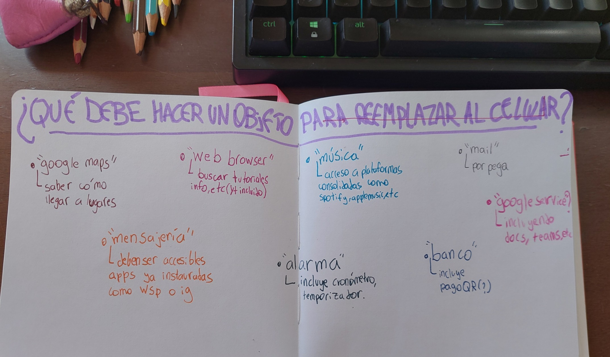
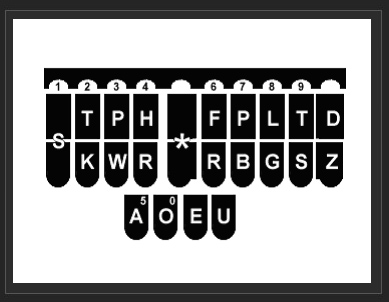
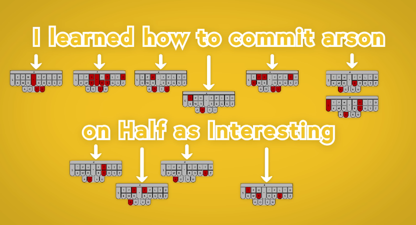
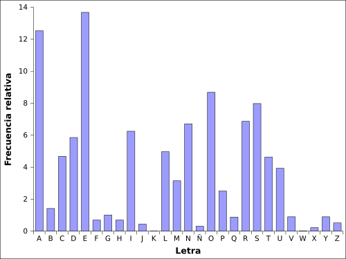

# sesion-08

avance preclase

hay cosas que el celular tiene que son necesarias.

Muchas de ellas se volvieron necesarias para nosotros una vez nos acostumbramos a tener celulares. pero eso no viene al caso.

si queremos que quienes quieran, puedan despojarse de sus celulares, debemos ofrecer un reemplazo para estas cosas esenciales a las que dejarían de tener acceso.

la ppt pa la sesion-08:

- <https://docs.google.com/presentation/d/1KC8jNBB1V_Pfp7c78TXlXI8Q17DaC1NZRWn21pMx14s/edit?usp=sharing>

## ideas de observación a usuarios

quizás sea mejor transicionar de *formato scroll infinito vertical a pantalla completa con algoritmo personalizado.* a *formatos de gratificación instantánea*.

** idea aparte, grabar a la gente sacndo su celular, sacar fotos de como lo toma, grabar como escribe en su teclado.

**otra idea: hacerlo más casual y vr en qué momentos se devían y entran a insta o tiktok.

### relfexión día domingo

¿si eliminarmos el factor vista, tendríamos interfaces menos sobrestimulantes, disminuyendo su intención de generar uso compulsivo?

como podemos diseñar formas de nevagar el cleular sin usar la vista?

esto **ya existe**. En android TalkBack, an IOS VoiceOver.

La percepción que tengo de talkback, es que es bastante incómodo y engorroso, siento que nadie que pueda permitirse no usarlo lo usaría.

cómo podemos diseñar un talkback que sea igual de friccionless que el uso default.

#### estenotipia

es una sitema de escritura rápida.

Cuenta con 21 teclas, las cuales se pueden preionar de más de una a la vez.

##### teclado

una persona promedio puede teclear aprox 40 palabras por minutos. El promedio de las personas que habitualmente escriben en su trabajo, promedian 60-70. Trabajos dedicados a la escritura en teclado, suelen exigir 80-95 palabras por minuto. Stella Pajunas, la escritora de teclado más veloz de la historia, podría escribir hasta 216 palabras por minuto.

Un estenógrafo puede tipiear entre 225-360 palabras por minuto

<https://youtu.be/UA6UythLlEI>

a diferencia de un teclado clásico, en una estetiopía, se escribe por sílabas. cada sílaba es una combinación de teclas. La sección izquierda se usa para las letras al inicio de la sílaba, y la sección derecha para escribir las letras alfinal de la sílaba.

aquí se muestra el algoritmo para escribir una frase.

###### frecuencia de letras

- <https://es.wikipedia.org/wiki/Frecuencia_de_aparici%C3%B3n_de_letras>

| Letra | Porcentaje |
| ----- | ---------- |
| E     | 13,68%     |
| A     | 12,53%     |
| O     | 8,68%      |
| S     | 7,98%      |
| N     | 6,71%      |
| R     | 6,87%      |
| I     | 6,25%      |
| D     | 5,86%      |
| L     | 4,97%      |
| C     | 4,68%      |
| T     | 4,63%      |
| U     | 3,93%      |
| M     | 3,15%      |
| P     | 2,51%      |
| B     | 1,42%      |
| G     | 1,01%      |
| V     | 0,90%      |
| Y     | 0,90%      |
| Q     | 0,88%      |
| H     | 0,70%      |
| F     | 0,69%      |
| Z     | 0,52%      |
| J     | 0,44%      |
| Ñ     | 0,31%      |
| X     | 0,22%      |
| K     | 0,02%      |
| W     | 0,01%      |

#### análisis abecedario

si quiero proponer una forma de escirbir coloquialmente, y que una ia te lo arregle el texto, debo meditar sobre la importancia de las letras.

- C: puede ser reemplazada por la S y la K
- Q: requiere un uso de la una letra extra, puede ser reemplazada por la k
- Z: puede ser reemplazada por la S
- H: sin palabras
- V: puede ser reemplazaba por la B(siento que es más común usar la B para todo que la V para todo.)
- W: es una G con una U
- Ü: deberíamos optar por g para el sonido de guagua, y j para el sonido de genial, eliminando la necesidad de usar dieresis.
- CH: puede ser reemplazada por la X

nuevo abecedario

|A|B|C|D|E|F|G|H|I|J|K|L|M|N|Ñ|O|P|Q|R|S|T|U|V|W|X|Y|Z|
|-|-|-|-|-|-|-|-|-|-|-|-|-|-|-|-|-|-|-|-|-|-|-|-|-|-|-|
|A|B|D|E|F|G|I|J|L|M|N|Ñ|O|P|Q|R|S|T|U|X|Y|-|-|-|-|-|-|

## relevante

libro:

- No Cosas: Quiebras del mundo de hoy

recomendaciones moss

- <https://www.xataka.com/especiales/transcribir-a-toda-velocidad-teclado-solo-21-teclas-oficio-estenotipista-alguien-que-lleva-35-anos-1>
- <https://en.wikipedia.org/wiki/Court_reporter>

recomendaciones aarón:

- <https://github.com/boazsender>
- <https://alliedmedia.org/leader/boaz-sender-los-angeles>
- <https://designjustice.org/steering-committee>
- <https://www.beaucoupconsult.com/about-1>
- <https://www.bocoup.com>

- <https://www.nyu.edu/footer/accessibility.html>
- <https://www.nyu.edu/life/community-flourishing/centers-and-communities/accessibility.html>

- <https://laurenrace.com>

asistentes por voz. interfaces para usar el celular para personas ciegas.

- <https://support.google.com/accessibility/android/answer/6283677?hl=en>
- <https://support.apple.com/guide/voiceover/welcome/mac>

## reflexiones

a mi no me gusta que me envíen audios, eso es pq está la posibilidad de leerlo? me seguiría dando lata si pudiera usar el celu sin mirarlo?

